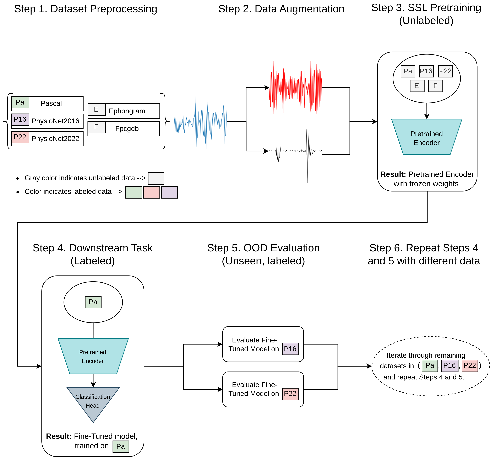
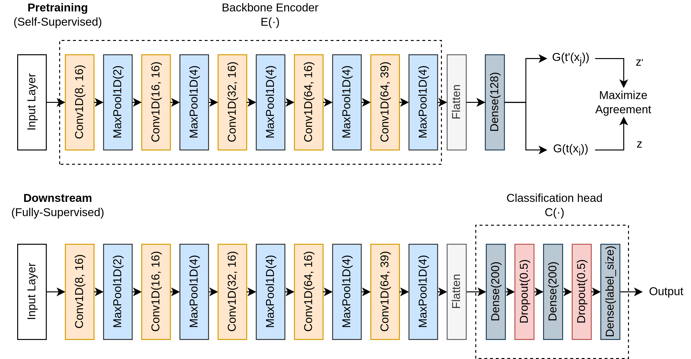

[](https://opensource.org/licenses/MIT) 

# Welcome to Listen2YourHeart

> This is the official code for the "On the Out-Of-Distribution Robustness of 
> Self-Supervised Representation Learning for Phonocardiogram Signals"
> preprint paper which has been submitted for publication.

Note: Repo might change in the future based on revisions and comments but can nevertheless be utilized
for research purposes.


An overview of the proposed training and evaluation protocol is depicted 
in the below image:





Listen2YourHeart is an IntelliJ project. The root folder (the one where this file is)
contains two main directories. The `scripts` dir holds all necessary scripts 
for a) downloading all data used in this project (`scripts\datasets`) and b) the 
source code for submitting pretraining and fine-tuning jobs to a 
[SLURM](https://slurm.schedmd.com/documentation.html) workload manager. 
As it names suggests, the `src` dir contains the source code for everything mentioned
in our paper.

****If not obvious, repo name and [previous work](https://ieeexplore.ieee.org/abstract/document/10081680) inspiration explained [here](https://www.youtube.com/watch?v=yCC_b5WHLX0&themeRefresh=1).*


## Project Structure

* `scripts`: directory containing scripts for downloading datasets and submitting SLURM jobs.
* `src`: directory containing source code of project
* `requirements.txt`: a simple requirements file that is used to re-create the environment
  of the project.
* `generate-requirements.sh`: convenience script for generating requirements and 
appropriate package dependecies.
* `pcg-ssl.iml`: the project file for IntelliJ.
* `README.md`: this file.


## Datasets
The datasets used in this project are:
* [FPCGDB](https://physionet.org/content/fpcgdb/1.0.0/): Fetal PCG Database
* [EPHNOGRAM](https://physionet.org/content/ephnogram/1.0.0/): A Simultaneous Electrocardiogram and Phonocardiogram Database
* [PASCAL](http://www.peterjbentley.com/heartchallenge/): Classifying Heart Sounds Challenge
* [PhysioNet2016](https://physionet.org/content/challenge-2016/1.0.0/): Classification of Heart Sound Recordings: The PhysioNet/Computing in 
Cardiology Challenge 2016
* [PhysioNet2022](https://moody-challenge.physionet.org/2022/): Heart Murmur Detection from Phonocardiogram Recordings: The George B. 
Moody PhysioNet Challenge 2022

## Quick Start
### 1. Download data
The first thing to do is download all necessary data.
To dowload each dataset you can run the following scripts and
commands from a terminal:

```console
# EPHNOGRAM
./scripts/download-ephnogram.sh

# FPCGDB
./scripts/download-fpcgdb.sh

# PASCAL
./scripts/download-pascal.sh

# PhysioNet2016
wget -r -N -c -np https://physionet.org/files/challenge-2016/1.0.0/

# PhysioNet2022
wget -r -N -c -np https://physionet.org/files/challenge-2022/1.0.0/
```

### 2. Specify Experiment Configuration
Once you have downloaded the data, the next step is to specify all 
parameters needed for the SSL pretraining and downstream task 
fine-tuning experiments.

To do that, edit the configuration file --> `./src/configuration/config.yml`


### 3. Fully-Supervised Model
To train a fully supervised CNN, run the following:

- <u>SLURM</u>
  ```console
  ./scripts/hpc/submit_baseline.sh "{experiment_name}" "./src/configuration/config.yml"
  ```

- <u>Python</u>
  ```
  python -m src.training.pretrain --ds_path "{path_to_save_model}" --conf_path "./src/configuration/config.yml"
  ```


### 4. Contrastive Self-Supervised Models
To train the proposed model via SSL, you once again need to specify all necessary
parameters in the configuration file (`./src/configuration/config.yml`).

The most important parameters are the 2 augmentation combinations, specified by the
`[ssl][augmentation1]` and `[ssl][augmentation2]` keys in the .yml.
We have provided examples on how to specify the transformations in the template
config file. However, you can also use that template to generate all the 
combinations mentioned in our paper by running the following scripts:

- <u>Populate different augmentation configurations</u>

  ```console
  # Populate config files for 0vs1 & 1vs1 augmentation combinations

  python3 -m src.configuration.populate_configs --config_file "./src/configuration/config.yml" --export_dir "{export dir of the populated configs}"

  # Populate config files for 1vs2 & 2vs2 augmentation combinations

  python3 -m src.configuration.populate_configs_2vs_2 --config_file "./src/configuration/config.yml" --export_dir "{export dir of the populated configs}"
  ```

To train classifiers using the proposed evaluation framework, you 
may run the following:

- <u>SLURM</u>
  ```console
  # Run multiple experiments with one or several configuration files
  # The script locates configuration .yml files under the specified 
  # dir and submits jobs to the slurm partition specified in 
  # `./scripts/hpc/pretrain.sh` and `./scripts/hpc/downstream.sh`  

  python3 -m scripts.hpc.submit_batch --conf_path "{config dir}" 
  ```

- <u>Python</u>
  ```console
  # Run single experiment with single config file
  # All arguments explained in pretrain.py
  
  python3 -m listen2yourheart.src.new_training.pretrain /
  --tmp_path {tmp_path} /
  --initial_epoch 0 /
  --ssl_job_epochs 200 /
  --ssl_total_epochs 200 /
  --conf_path {conf_path}
  ```

### 5. Results
All results will be available in a .csv file, which is specified in the `[results]` key of the configuration .yml.


## Framework Extension Ideas
Our codebase presents future researchers and practioners with the
opportunity to extend our initial findings towards the development 
of novel approaches and methods.

Specifically, some initial thoughts on the above are the following.

### Augmentation Development
All implemented augmentations and transformations are located in:
`./src/augmentations/augmentations.py`

By creating the appropriate python class, one can develop novel (or 
known augmentations which have not yet been implemented) transformations and 
apply them during SSL pretraining.

Once developed, the `_create_augmentors` function in 
`./src/dataset/generics.py` should also change accordingly to facilitate
the new transformation class and specification in the configuration .
yml.


### Model Development
The implemented neural network adopted in our research is a 5-layer
1D CNN, illustrated in the below figure.



However, you can of course consider using a different or novel 
architecture for the same task. 

All models are specified in the `./src/models/` directory.


### Loss Function
Finally, in our paper we chose to implement the `NT-XENT` contrastive loss 
introduced in the [SimCLR](https://github.com/google-research/simclr) 
framework::


You can of course select to change it and experiment with 
different contrastive-based losses.


## References

If you use the above code for your research please cite our paper, which
is currently under review at [IEEE Transactions on Biomedical Engineering](https://ieeexplore.ieee.org/xpl/RecentIssue.jsp?punumber=10):

```citation
Will upload ArXiv paper citation when available.
```


This repo is an extension of our initial work in "[Listen2YourHeart: A Self-Supervised Approach for Detecting Murmur in Heart-Beat Sounds](https://ieeexplore.ieee.org/abstract/document/10081680)".

```citation
@INPROCEEDINGS{10081680,
  author={Ballas, Aristotelis and Papapanagiotou, Vasileios and Delopoulos, Anastasios and Diou, Christos},
  booktitle={2022 Computing in Cardiology (CinC)}, 
  title={Listen2YourHeart: A Self-Supervised Approach for Detecting Murmur in Heart-Beat Sounds}, 
  year={2022},
  volume={498},
  number={},
  pages={1-4},
  doi={10.22489/CinC.2022.298}
  }

```

## License
This source code is released under the MIT license.